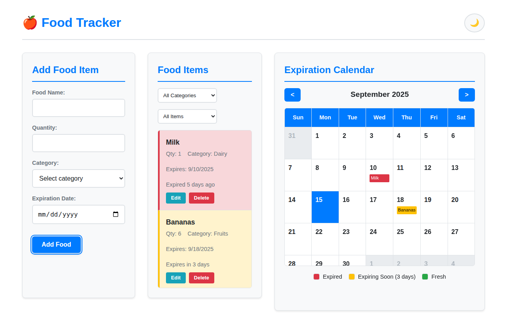

# 🍎 Food Tracker Application

A modern, responsive web-based Food Tracker application built with plain HTML, CSS, and JavaScript. Track your food items, monitor expiration dates, and never let food go to waste again!

## Features

### 🎯 Core Functionality
- **Add, Edit, Delete Food Items**: Manage your food inventory with name, quantity, category, and expiration date
- **Visual Calendar View**: See all your food items displayed on their expiration dates
- **Smart Status Indicators**: 
  - 🔴 Expired items (past expiration date)
  - 🟡 Expiring soon (within 3 days)
  - 🟢 Fresh items (more than 3 days remaining)

### 🎨 User Experience
- **Dark/Light Mode Toggle**: Switch between themes with persistent user preference
- **Responsive Design**: Works seamlessly on desktop, tablet, and mobile devices
- **Filtering System**: Filter food items by category or expiration status
- **Overflow Handling**: Scrollable lists and calendar for large amounts of data

### 💾 Data Persistence
- **IndexedDB Storage**: Robust offline data storage in your browser
- **No Server Required**: Everything runs locally in your browser
- **Settings Persistence**: Theme preferences and data survive browser restarts

## Technology Stack

- **HTML5**: Semantic markup and modern web standards
- **CSS3**: CSS custom properties, Grid, Flexbox, and responsive design
- **Vanilla JavaScript**: ES6+ features, IndexedDB API, DOM manipulation
- **No Frameworks**: Lightweight and fast with zero dependencies

## Getting Started

1. **Clone or download** this repository
2. **Open `index.html`** in any modern web browser
3. **Start adding food items** and track their expiration dates!

### Running Locally

For development or testing:

```bash
# Using Python (if installed)
python3 -m http.server 8000

# Using Node.js (if installed)
npx serve .

# Or simply open index.html in your browser
```

## Browser Support

- ✅ Chrome/Edge 63+
- ✅ Firefox 57+
- ✅ Safari 13+
- ✅ All modern mobile browsers

*Note: Requires IndexedDB support for data persistence*

## Screenshots

### Light Mode


### Dark Mode


### Mobile Responsive


## Food Categories

The application supports the following food categories:
- 🍎 Fruits
- 🥕 Vegetables  
- 🥛 Dairy
- 🥩 Meat
- 🌾 Grains
- 🥤 Beverages
- 🍿 Snacks
- 📦 Other

## Usage Tips

1. **Add items before shopping** to avoid buying duplicates
2. **Check the calendar weekly** to plan meals around expiring items
3. **Use filters** to quickly find expired or expiring-soon items
4. **Enable dark mode** for comfortable evening use
5. **The app works offline** - no internet connection required!

## Architecture

### File Structure
```
├── index.html      # Main HTML structure and UI
├── styles.css      # CSS styling, themes, and responsive design
├── main.js         # JavaScript logic, IndexedDB, and calendar
└── README.md       # This documentation
```

### Key Classes and Functions
- `FoodTracker`: Main application class
- IndexedDB operations: `initDB()`, `addFood()`, `updateFood()`, `deleteFood()`
- UI rendering: `renderFoodList()`, `renderCalendar()` 
- Theme management: `toggleTheme()`, `loadTheme()`
- Status calculation: `getFoodStatus()`

## Contributing

This is a simple, educational project demonstrating modern web development with vanilla technologies. Feel free to fork and enhance!

## License

MIT License - see LICENSE file for details.

---

**Happy food tracking! 🍽️**